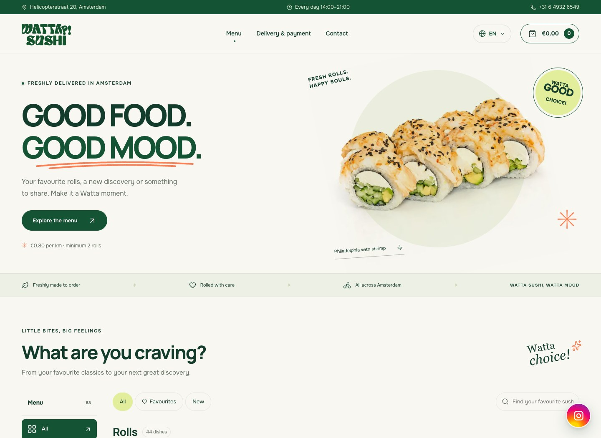
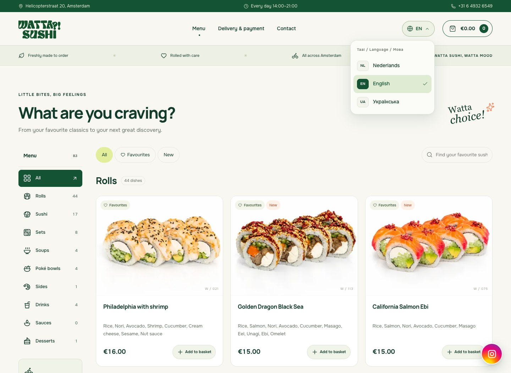
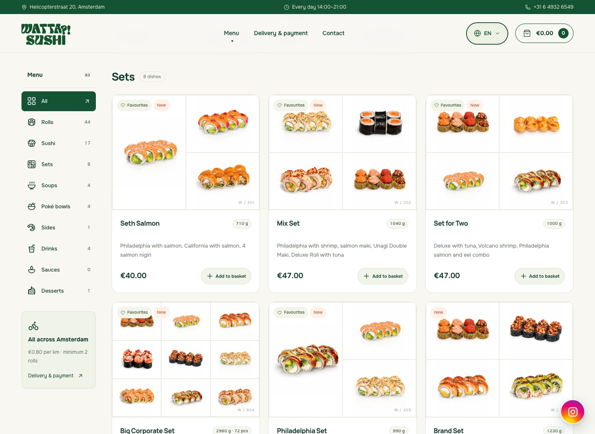
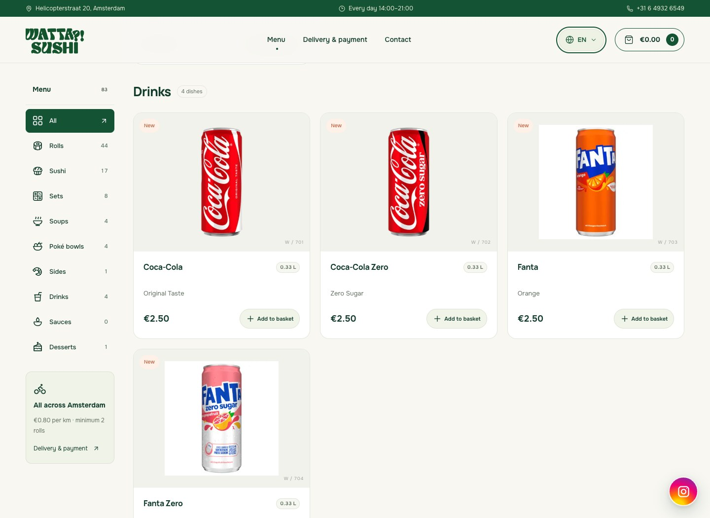
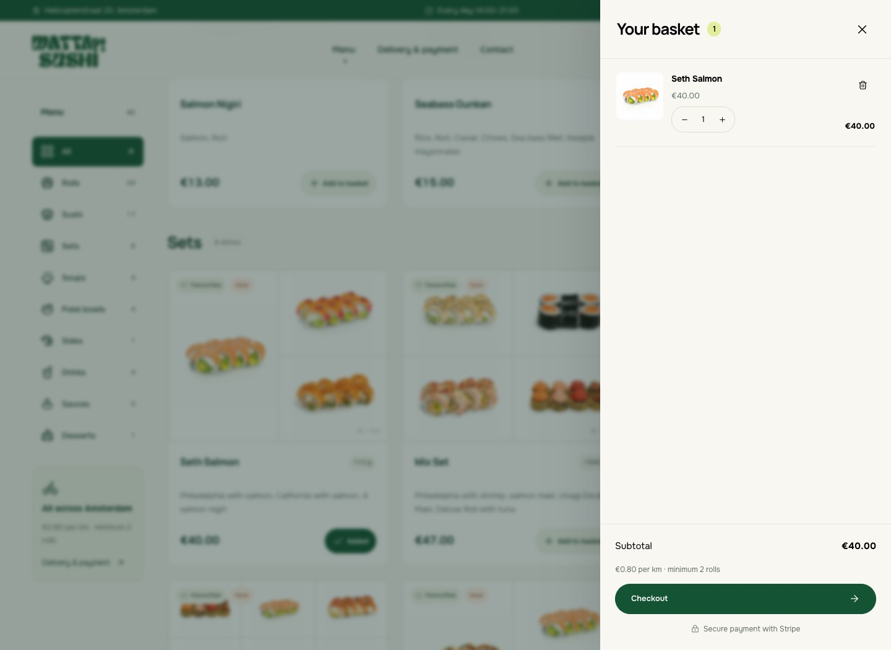
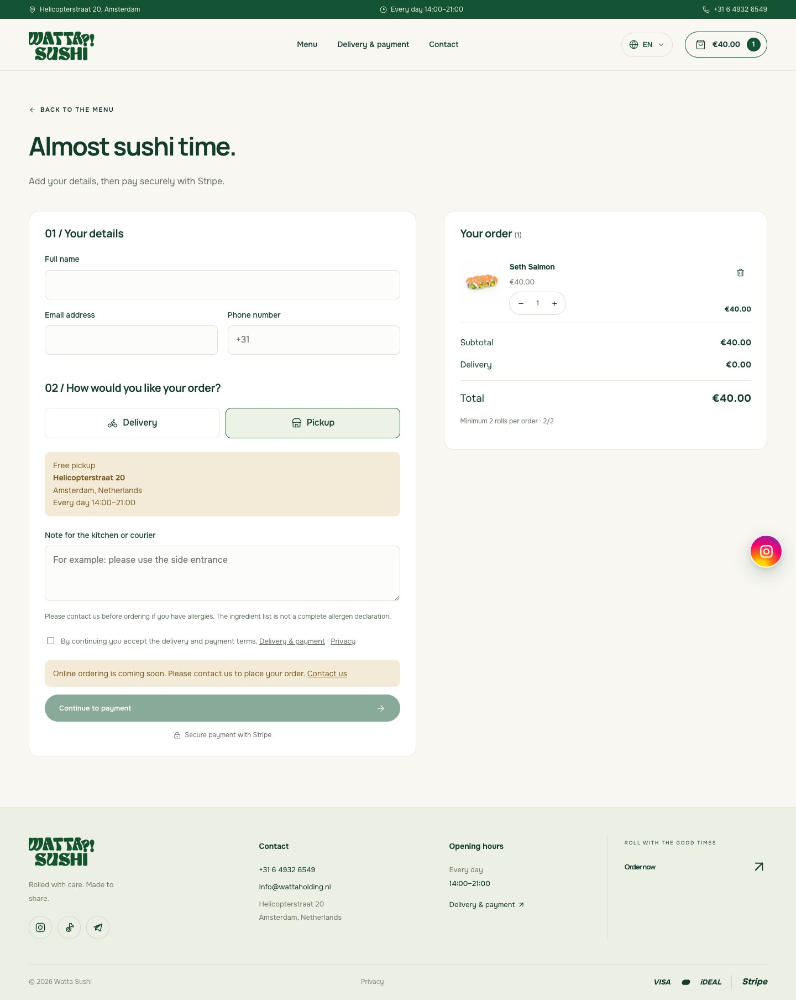
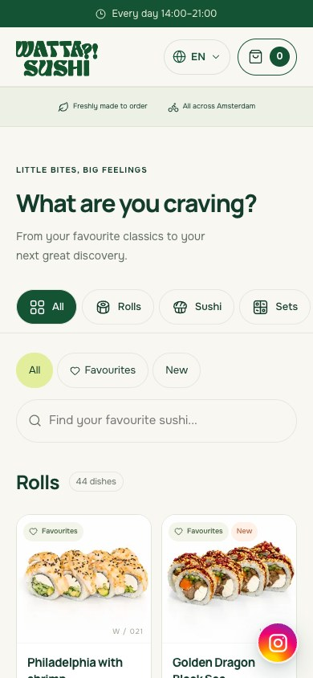

# Watta Sushi

A production-shaped online sushi shop for Amsterdam. The interface is available in Dutch, English and Ukrainian and includes a real catalog, responsive basket and checkout flow, distance-based delivery, Stripe Checkout integration, SQLite orders and payment email handling.



## Design and main functions

- Responsive editorial storefront built around the supplied Watta Sushi identity.
- 83 catalog items across rolls, sushi, sets, soups, poké bowls, sides, drinks, sauces and desserts.
- Eight curated set cards and four drink cards with real prices, portions and product imagery.
- Personal favourites on every product, localStorage persistence and a favourites-only filter with an empty state.
- Persistent basket, quantities, a minimum of two rolls, pickup and Amsterdam delivery.
- Custom language menu for Nederlands, English and Українська.
- Fixed Instagram shortcut, native SVG interface icons and reduced-motion support.
- Server-side price validation, Stripe Checkout, signed webhook handling and idempotent order fulfillment.

### Store experience

| Menu and language | Sets | Drinks |
| --- | --- | --- |
|  |  |  |

| Basket | Checkout | Mobile menu |
| --- | --- | --- |
|  |  |  |

### Pages and every menu section

- [Menu overview](screenshots/02-menu-overview.jpg)
- [Rolls](screenshots/categories/01-rolls.jpg)
- [Sushi](screenshots/categories/02-sushi.jpg)
- [Sets](screenshots/categories/03-sets.jpg)
- [Soups](screenshots/categories/04-soups.jpg)
- [Poké bowls](screenshots/categories/05-poke-bowls.jpg)
- [Sides](screenshots/categories/06-sides.jpg)
- [Drinks](screenshots/categories/07-drinks.jpg)
- [Sauces](screenshots/categories/08-sauces.jpg)
- [Desserts](screenshots/categories/35-desserts.jpg)
- [Delivery and payment](screenshots/04-delivery-and-payment.jpg)
- [Contacts](screenshots/05-contacts.jpg)

## Run locally

Requires Node.js 24+ and npm.

```sh
npm ci
cp .env.example .env.local
npm run dev
```

Open http://localhost:3000. The menu, basket, pickup form, contacts and language switching work without credentials. Payment requires Stripe keys and durable order storage. SMTP is optional for payment creation; email jobs wait until a sender is configured. Delivery calculation needs a server-only Mapbox token and a quote signing secret; it does not substitute a made-up fee. See [deployment checklist](docs/launch-configuration.md) for the current Vercel blocker.

```sh
npm test
npm run typecheck
npm run build
npm start
```

## Confirmed business settings

- Watta Sushi; supplied PDF logos rendered to PNG under `public/brand`.
- EUR. Delivery throughout Amsterdam. Pickup: Helicopterstraat 20, Amsterdam, Netherlands.
- Every day 14:00–21:00, Europe/Amsterdam time.
- Minimum **two rolls** per order, also for pickup. Two quantities of the same roll count; sushi, bowls and other categories do not count as rolls.
- Delivery **€0.80 per kilometre of the driving route**, rounded to the nearest eurocent. Pickup is free.
- +31649326549, Info@wattaholding.nl; supplied Instagram, TikTok and Telegram links.

Driving distance (rather than straight-line distance), cents rounding and free pickup are implementation assumptions. If the business uses a different rule, change the pricing and copy together.

## Real menu

`content/source` contains a public API snapshot from the source site, endpoint provenance, 71 original products and an ingredient dictionary. `lib/curated-products.ts` adds the supplied sets and drinks, bringing the displayed catalog to 83 items. Product names and descriptions use source translations. Missing original descriptions are assembled from source ingredient IDs. The source API snapshot has no variant/weight fields; add genuine variants and server validation when supplied.

Images are stored locally in `public/menu`; Next Image provides responsive optimization. Re-run `python3 scripts/import-images.py` to fetch missing images. It does not overwrite existing images. The catalog adapter is `lib/catalog.ts`; base prices are converted to integer eurocents, and archived/inactive products are excluded. Empty source categories are hidden; the source includes a dessert category.

## Stripe test setup

1. Set `STRIPE_SECRET_KEY` to a Stripe sandbox `sk_test_…` value in `.env.local`.
2. Forward webhook events with the Stripe CLI:

   ```sh
   stripe listen --forward-to localhost:3000/api/stripe/webhook
   ```

3. Set the CLI signing secret as `STRIPE_WEBHOOK_SECRET` and restart the app.
4. Configure SMTP as below. Add two rolls and use pickup to test without a Maps key.
5. Complete Stripe Checkout with a Stripe test card, such as `4242 4242 4242 4242`, a future expiry and any valid test CVC. Check order status and the email outbox in SQLite.
6. Also test cancelled Checkout, repeated webhooks, asynchronous success/failure, SMTP failure/retry and a genuine Amsterdam delivery address before launch.

The server accepts only product IDs and quantities, rebuilds line items from its catalog and uses one Stripe idempotency key per persisted request. Client-supplied prices are rejected. Cart recovery happens locally; a success redirect by itself cannot mark an order paid. The success page polls the database and only clears the basket when payment is confirmed.

Register these events on the deployed webhook:

- `checkout.session.completed`
- `checkout.session.async_payment_succeeded`
- `checkout.session.async_payment_failed`
- `checkout.session.expired`

The handler verifies Stripe's raw-body signature and matches session identity, reference, currency and amount. Payment fulfillment and customer email queuing are atomic and idempotent in SQLite. Card/Apple Pay/Google Pay/iDEAL availability is managed by the Stripe dashboard and depends on account, device and eligibility; the code does not falsely force wallet availability.

Live keys are rejected unless `STRIPE_LIVE_APPROVED=true`. Change this only after the owner approves live payments. Use HTTPS `APP_URL` in production. Do not paste secret keys into source files or chat.

## Delivery routing

Set server-only `MAPBOX_ACCESS_TOKEN` and `DELIVERY_QUOTE_SECRET` (at least 32 random bytes, for example `openssl rand -hex 32`). The adapter uses Mapbox Geocoding v6 structured address input and Directions `driving`. It geocodes the restaurant and destination, verifies Amsterdam, postcode, street and house number, and charges €0.80 per kilometre. Geocoding responses are not cached or stored.

The quote is an HMAC-signed token containing an address hash, route metres and a 15-minute expiry; it needs no local database and works across Vercel instances. Checkout verifies the signature, expiry and address, recalculates the route with Mapbox, and rebuilds the fee server-side. If the price changed, payment is refused until the customer recalculates. Changing the address invalidates the client quote. Unavailable routing never becomes zero-cost delivery.

Real Mapbox routing and real Stripe payments have not been exercised without account credentials. Automated tests cover the routing adapter with mock API responses.

## Email and orders

Set `SMTP_HOST`, `SMTP_PORT`, `SMTP_FROM`, and credentials if required. Use a verified sender. `OWNER_EMAIL` is optional; leave it empty for customer-only confirmations.

After verified payment the webhook queues email jobs in the same database transaction and attempts delivery after returning the HTTP response. Failed jobs remain pending. Run the following from the app directory for retries:

```sh
npm run email:retry
```

The command loads `.env.local`. In production, invoke the equivalent `node --import tsx scripts/retry-emails.ts` with the deployment environment, periodically from a process supervisor or scheduler. A crashed sender's lease expires after two minutes. SMTP is at-least-once delivery: a crash immediately after SMTP accepts a message can cause a duplicate on retry; deterministic Message-ID helps mail clients recognize it.

`orders` stores customer details, item and price snapshots, fulfillment method, payment state, session ID and timestamps. `email_jobs` stores pending/sent status and attempts. There is no public order-list endpoint. The status endpoint uses a high-entropy Stripe session ID and returns only the short order number, total and state. There is no admin panel in this version.

## Hosting

Deploy on one persistent Node.js 24 instance (for example Render with a persistent disk or a VPS). Set `DATABASE_PATH` to a path on that disk, back it up together with WAL state using SQLite's backup facility, and configure HTTPS `APP_URL`, Stripe webhook and SMTP. Build with `npm ci && npm run build`, start with `npm start`.

**Do not deploy this SQLite version to ephemeral/serverless storage or multiple replicas.** Use shared PostgreSQL before choosing a serverless deployment. Set edge rate limits for `/api/checkout` and `/api/delivery-quote` before public launch to protect payment creation and the metered Maps API. Configure email retries and operational monitoring with the host.

Before public launch, verify real payment/routing/email integrations and business delivery estimates, and finalize the business's legal/privacy terms (including registration/VAT details and retention policy). Current customer-facing privacy text is a short informational draft, not a finished legal document.

## Checks and previews

- Unit/integration tests in `tests/orders.test.ts`: canonical prices, roll minimum, input tampering, cents rounding, city validation, request deduplication, paid/unpaid fulfillment, duplicate webhooks, quote binding, routing adapter and Stripe signatures.
- `scripts/browser-check.mjs`: desktop/mobile browser smoke test using a local Chrome executable; checks three languages, adding two rolls, basket persistence, pickup, missing configuration, search and overflow. Update the executable path on other machines.
- `npm run screenshots`: reproducibly captures the page and category gallery under `screenshots/` while the development server is running.
- `SECURITY.md`: implemented safeguards, the latest audit record and deployment requirements.

Reference documentation: [Stripe fulfillment](https://docs.stripe.com/checkout/fulfillment), [Mapbox Geocoding](https://docs.mapbox.com/api/search/geocoding/), [Mapbox Directions](https://docs.mapbox.com/api/navigation/directions/). Next.js documentation for the installed version is bundled in `node_modules/next/dist/docs`.
